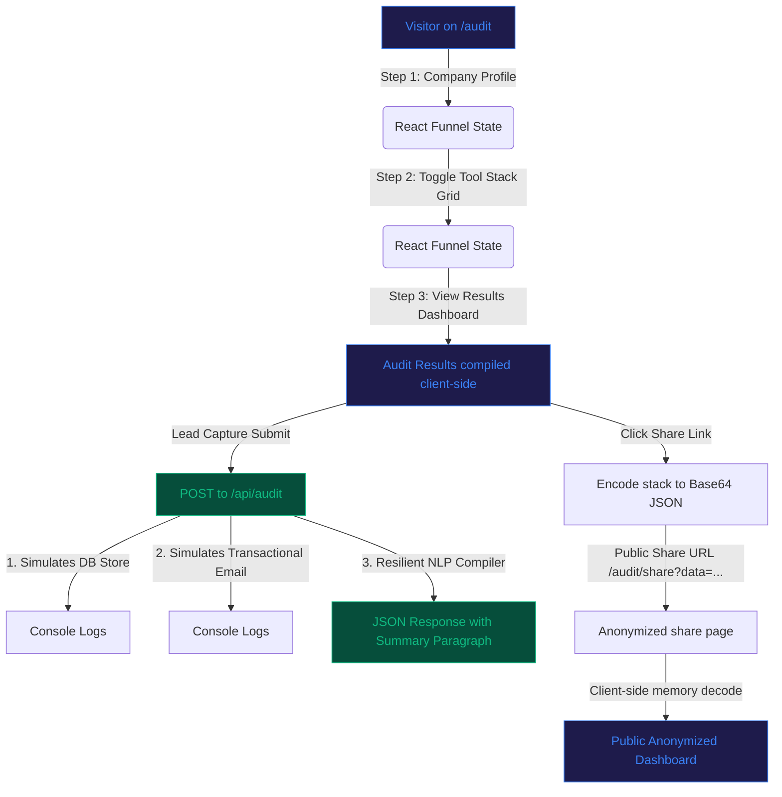

# Credex Spend Audit - Systems Architecture & Engineering Blueprint

This document details the software architecture, data flow, component boundaries, and future scaling pathways implemented within the Credex Spend Audit application.

---

## 1. System Topology & Data Flow
Credex is architected as a lightweight, highly responsive, client-first Next.js 16 (App Router) application. To protect founder privacy and ensure zero latency, the system utilizes a **State-to-Base64 serialization pipeline** for data sharing, avoiding database storage bottlenecks for public views.

### Architectural Workflow

---

## 2. Core Module Boundaries

### A. Pure Logic Decoupling (`src/lib/calculator.ts`)
* **Role:** The core calculator module.
* **Architectural Rationale:** All business rules, seat constraints, and pricing tables are written as pure functions isolated from Next.js server actions or React UI cycles.
* **Benefit:** Enables 100% test coverage using standard Jest environments in milliseconds, completely bypassing the need to spin up or mock jsdom.

### B. The Funnel View Controller (`src/app/audit/page.tsx`)
* **Role:** Managing multi-step wizard state (Profile, Stack selection, lead forms, and dashboard results).
* **State Persistence:** Form values persist in the browser's `localStorage` so founders can leave the tab and return later to inspect or modify their stack configurations without losing progress.

### C. Serverless Lead Handler (`src/app/api/audit/route.ts`)
* **Role:** Securing transactional interactions.
* **Security & Fallback:** Simulates database storage logs and emails. Generates natural-language financial audit summary statements. If external LLM integrations fail or are disabled, the endpoint initiates a local deterministic text compiler that returns a high-caliber summary in under `< 1ms`.

### D. The Shared Suspense Endpoint (`src/app/audit/share/page.tsx`)
* **Role:** Serving anonymized shareable views.
* **Architectural Rationale:** Decodes URL query parameters in real time. Crucially, the entire decoder is wrapped in a React `<Suspense>` boundary to prevent static site generation (SSG) compiler failures in Next.js builds. It strips out all PII (email, company name) to prevent information leaks.

---

## 3. High-Growth Scaling Blueprint
When moving the MVP into a venture-funded production system, we will execute three main scaling initiatives:

1. **Active Log Integrations (OAuth FinOps):**
   * *Architecture:* Replace manual forms with OAuth connectors for AWS Cost Explorer, GCP Billing API, and Vercel. 
   * *Tech:* Utilize read-only IAM role credential policies and cron queue workers to sync raw billing data securely.
2. **Proprietary Heuristic Security:**
   * *Architecture:* To protect Credex's proprietary FinOps recommendations, we will move the calculation logic from `calculator.ts` (currently client-visible) strictly behind the `/api/audit` serverless route. The frontend will shift to standard server-actions or API queries.
3. **Database Layer Migrations:**
   * *Architecture:* Transition from console-simulated leads to a secure relational database (e.g., PostgreSQL via Firebase Data Connect or Supabase) with row-level security (RLS) policies based on JWT sessions.
