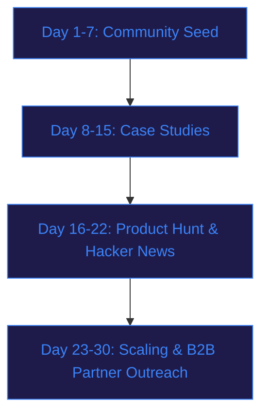

# Credex Spend Audit - Go-To-Market & Growth Strategy Plan
This growth manual details the $0 budget 30-day user acquisition plan and viral referral loops for scaling the Credex AI Spend Audit platform to developer communities and startups.

---

## 1. Target User Profiles
We focus on three specific high-intent profiles prone to "AI spend fatigue":
1. **The Capital-Conscious CTO/Founder:** Managing seed/Pre-Seed startups, juggling tight cash runway, and paying for duplicate subscriptions (e.g., Cursor, Copilot, ChatGPT, Claude) across 3-15 engineers without central oversight.
2. **The Lead Engineer / Tech Lead:** Tired of arguing with management about tool approvals, wanting to unify the engineering stack onto superior tools (Claude + Cursor), and seeking structural cost justification to present to finance.
3. **The Fractional CFO / FinOps Advisor:** Managing 5-10 client startup portfolios, seeking instant tooling audits to prove value, and recommending savings strategies to founders.

---

## 2. Target Online Developer Spaces & Channels
We acquire our first 500 users where cost-conscious builders hang out:
* **Reddit Communities:**
  * `r/startups` (1.3M+ members) - Ideal for sharing case studies on "How we shaved 40% off our engineering spend in 5 minutes."
  * `r/ycombinator` (90k+ members) - Active builders running out of funding looking for immediate credit hacks.
  * `r/sasa` & `r/LocalLLaMA` - Communities deeply technical about API cost optimizations and prompt caching.
* **Developer Discord / Slack Communities:**
  * Next.js, Vercel, and Cursor official Discord servers where developers share tooling tips.
  * LaunchY (YC Discord) and regional founder Slack directories (e.g., Techstars, local hubs).
* **Product Discovery Platforms:**
  * **Product Hunt:** Launching Credex as a "Free startup spend optimization utility" to capture organic traffic from founders.
  * **Hacker News:** Submitting show HN with the hook: "Show HN: A zero-leakage, DB-free tool stack spend auditor."

---

## 3. The 30-Day $0 Budget Acquisition Blueprint



### Phase 1: Community Seeding (Days 1–7)
* Author highly technical guides on Reddit explaining the math behind Claude Team and ChatGPT Team's seat minimum traps (the $150/mo minimum for teams under 5 users).
* Provide a direct link to the free, zero-signup audit tool so founders can inspect their own stacks immediately.

### Phase 2: High-Value Case Studies (Days 8–15)
* Audit 3 friendly startups manually. Publish full, anonymized breakdown articles on LinkedIn and Twitter/X showing how they saved \$800/mo.
* Share the raw base64 shareable URLs of their audits directly in the posts to showcase product capability.

### Phase 3: The Hacker News & Product Hunt Double-Punch (Days 16–22)
* Submit to Hacker News explaining the technical decision to serialize data into the URL payload to preserve user privacy (zero-leakage base64 model).
* Launch on Product Hunt under "Developer Tools / FinOps."

### Phase 4: B2B Channel Partner Outreach (Days 23–30)
* Reach out to fractional CFO firms, startup accelerators, and venture funds. Offer them a co-branded link to the audit tool to distribute as a "free value-add" to their portfolio founders.

---

## 4. Viral Distribution & Referral Loops
To achieve compound growth, we embed a viral loop directly into the audit user experience:

```mermaid
flowchart LR
    A[Founder Runs Audit] --> B[Gets Anonymized Report]
    B --> C[Generates Base64 Share Link]
    C --> D[Shares on Slack / X]
    D --> E[Others click: "How much is your team overpaying?"]
    E --> A
    
    style A fill:#064e3b,stroke:#10b981,color:#10b981
    style B fill:#064e3b,stroke:#10b981,color:#10b981
    style C fill:#064e3b,stroke:#10b981,color:#10b981
    style D fill:#064e3b,stroke:#10b981,color:#10b981
    style E fill:#064e3b,stroke:#10b981,color:#10b981
```

1. **The "Anonymized Flex" Shareable Link:** After completing an audit, the user gets a "Share This Anonymized Report Card" button. This encodes their tool selections and recommended savings into a base64 string in the URL.
2. **Zero-Leakage Privacy:** Because it uses Base64 serialization, the share page strips out all PII (email, company name, roles) while displaying the tool breakdown. Founders can confidently share these links in their internal team Slacks, public Twitter/X threads, or LinkedIn profiles without leaking confidential business details.
3. **The Viral CTA Hook:** When a third party views a shared report card, they are presented with a dashed card at the bottom: *"How much is your team overpaying? Run my free AI Spend Audit."* This loop drives high-intent, low-cost referral traffic.
